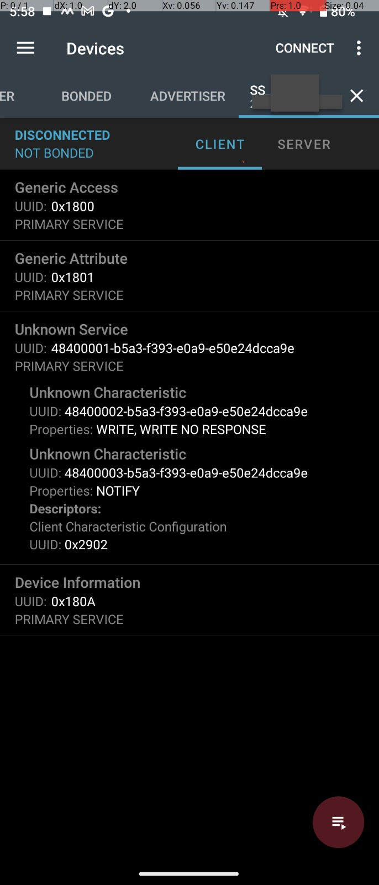

# Bluetooth LE
The service uses two UUIDs to manage send requests & getting notifications.

### 48400002-B5A3-F393-E0A9-E50E24DCCA9E
This is mainly used for sending data. Like unlocking the door & locking the door.

### 48400003-B5A3-F393-E0A9-E50E24DCCA9E
This is for sending notifications, mainly just saying `Hey, your door is unlocked` or `Hey, your door is locked` or sending how much fingerprints are in the device?

## nRF Connect screenshot
